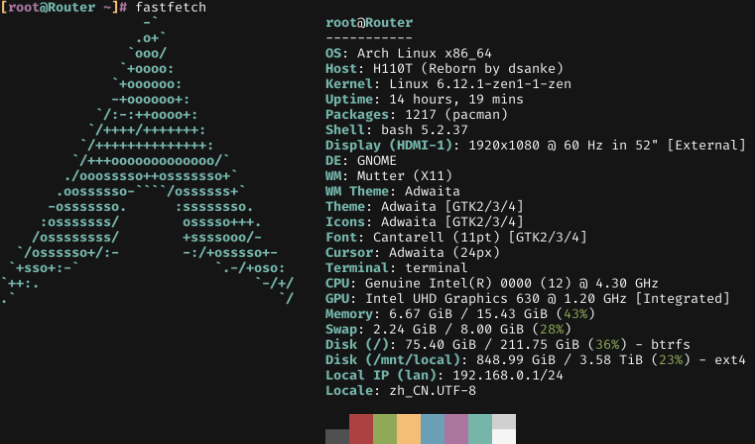

# OS Terminal

A `no_std` terminal library for embedded systems and OS kernels.

The environment should have initialized `global_allocator` since `alloc` crate is used for dynamic memory allocation.

## Screenshot



This screenshot shows the result of running `fastfetch` in the example terminal. You can try it by running `cargo run --release --example terminal --features=truetype` (Linux only). It will execute `bash` by default.

## Features

- Embedded smooth noto sans mono font rendering
- Truetype font support
- VT100 and part of xterm escape sequence support
- Beautiful color scheme
- Cursor display and shape control

## Usage

Create a display wrapper to wrap your framebuffer and implement the `DrawTarget` trait for it.

```rust
use alloc::boxed::Box;
use os_terminal::{DrawTarget, Rgb, Terminal};
use os_terminal::font::BitmapFont;

struct Display {
    width: usize,
    height: usize,
    buffer: &'static [u32],
}

impl DrawTarget for Display {
    fn size(&self) -> (usize, usize) {
        (self.width, self.height)
    }

    #[inline(always)]
    fn draw_pixel(&mut self, x: usize, y: usize, color: Rgb) {
        let value = (color.0 as u32) << 16 | (color.1 as u32) << 8 | color.2 as u32;
        self.buffer[y * self.width + x] = value;
    }
}
```

Then you can create a terminal with a box-wrapped font manager.

```rust
let mut terminal = Terminal::new(display);
terminal.set_font_manager(Box::new(BitmapFont));
```

Now you can redirect the keyboard events to the terminal in scancode format (currently only Scan Code Set1 and North American standard English keyboard layout are supported) to let the terminal process shortcuts or get escaped strings so you can pass it to your shell.

```rust
// LCtrl pressed, C pressed, C released, LCtrl released
let scancodes = [0x1d, 0x2e, 0xae, 0x9d];

for scancode in scancodes.iter() {
    if let Some(ansi_string) = terminal.handle_keyboard(*scancode) {
        // Pass the ansi_string to your shell (None Some("\u{3}") None None)
    }
}
```

And then you can advance the terminal state with the escaped string from the output of your shell.

```rust
terminal.process(b"\x1b[31mHello, world!\x1b[0m");
terminal.write_fmt(format_args!("{} + {} = {}", 1, 2, 3));
```

To use truetype font, enable `truetype` feature and create a `TrueTypeFont` instance from a font file with size.

```rust
let font_buffer = include_bytes!("SourceCodeVF.otf");
terminal.set_font_manager(Box::new(TrueTypeFont::new(10.0, font_buffer)));
```

Notice that you are supposed to use a variable-font-supported ttf file otherwise font weight will not change.

Italic font support is also optional. If not provided, it will be rendered with default Roman font.

```rust
let font_buffer = include_bytes!("SourceCodeVF.otf");
let italic_buffer = include_bytes!("SourceCodeVF-Italic.otf");
let font_manager = TrueTypeFont::new(10.0, font_buffer).with_italic_font(italic_buffer);
terminal.set_font_manager(Box::new(font_manager));
```

If you want to get the logs from the terminal, you can set a logger that receives `fmt::Arguments`.

```rust
os_terminal::set_logger(|args| println!("Terminal: {:?}", args));
```

Default flush strategy is synchronous. If you need higher performance, you can disable the auto flush and flush manually when needed.

```rust
terminal.set_auto_flush(false);
terminal.flush();
```

The terminal comes with 8 built-in themes. You can switch to other themes manually by calling `terminal.set_color_scheme(index)`.

Custom theme is also supported:

```rust
let palette = Palette {
    color_pair: (...),
    ansi_colors: [...],
}

terminal.set_custom_color_scheme(palette);
```

Note that this setting is temporary and you will need to re-execute `set_custom_color_scheme` if you switch to another theme.

Default history size is `200` lines. You can change it by calling `terminal.set_history_size(size)`.

Moreover, you can use `terminal.set_bell_handler(handler)` to set the bell handler so that when you type `unicode(7)` such as `Ctrl + G`, the terminal will call the handler to play the bell.

## Shortcuts

With `handle_keyboard`, some shortcuts are supported:

- `Ctrl + Shift + F1-F8`: Switch to different built-in themes
- `Ctrl + Shift + ArrowUp/ArrowDown`: Scroll up/down history
- `Ctrl + Shift + PageUp/PageDown`: Scroll up/down history by page

## Features

- `bitmap`: Enable embedded noto sans mono bitmap font support. This feature is enabled by default.
- `truetype`: Enable truetype font support. This feature is disabled by default.

## Acknowledgement

- [embedded-term](https://github.com/rcore-os/embedded-term): This project is a fork of it with some simplifications and improvements.
- [alacritty](https://github.com/CyberFlameGO/alacritty): General reference for the terminal implementation.
- [noto-sans-mono-bitmap-rs](https://github.com/phip1611/noto-sans-mono-bitmap-rs): Pre-rasterized smooth characters.

Thanks to the original author and contributors for their great work.
